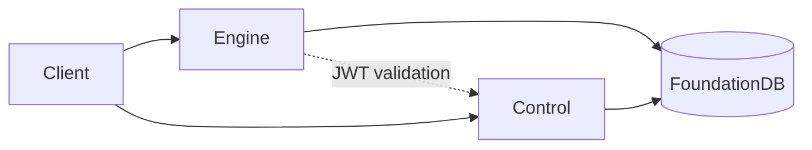

# InferaDB

**The distributed inference engine for authorization** — fine-grained, low-latency permission checks at scale.

Inspired by [Google Zanzibar](https://research.google/pubs/zanzibar-googles-consistent-global-authorization-system/) and [AuthZEN](https://openid.net/wg/authzen/) compliant.

## Why InferaDB?

- **Sub-millisecond latency** — <1ms cached, 3-5ms uncached at 100K+ RPS
- **Declarative policies (IPL)** — Version-controlled, testable, composable authorization logic
- **WASM extensibility** — Embed custom logic in sandboxed modules
- **Multi-tenant isolation** — Per-tenant encryption, namespaces, and audit logs
- **Graph-native ReBAC** — Model hierarchies, groups, and ownership as traversable relationships

## Quick Start

```bash
git clone https://github.com/inferadb/inferadb && cd inferadb
git submodule update --init --remote
make setup && make engine-dev
```

Check a permission:

```bash
curl -X POST http://localhost:8080/v1/evaluate \
  -H "Content-Type: application/json" \
  -d '{"evaluations": [{"subject": "user:alice", "resource": "doc:readme", "permission": "viewer"}]}'
```

Response:

```json
{ "results": [{ "decision": "allow" }] }
```

## Components

| Component                                            | Purpose                       |
| ---------------------------------------------------- | ----------------------------- |
| [engine/](https://github.com/inferadb/engine/)       | Authorization policy engine   |
| [control/](https://github.com/inferadb/control/)     | Control plane (tenants, auth) |
| [dashboard/](https://github.com/inferadb/dashboard/) | Management web dashboard      |
| [tests/](https://github.com/inferadb/tests/)         | E2E integration tests         |
| [docs/](https://github.com/inferadb/docs/)           | Specifications and guides     |

## Architecture



**Stack:** Rust, FoundationDB, gRPC/REST, Kubernetes

## Commands

```bash
make help             # List all commands
make build            # Debug build
make check            # Format, lint, audit
make test             # Unit tests
make engine-dev       # Engine with hot-reload
make control-dev      # Control API with hot-reload
make dashboard-dev    # Dashboard on http://localhost:5173
```

Kubernetes:

```bash
make k8s-start        # Start local K8s stack
make k8s-status       # Check deployment health
make k8s-stop         # Stop (preserves data)
make k8s-purge        # Remove all resources
```

## Documentation

- [engine/README.md](https://github.com/inferadb/engine/blob/main/README.md) — Authorization engine
- [control/README.md](https://github.com/inferadb/control/blob/main/README.md) — Control plane API
- [tests/README.md](https://github.com/inferadb/tests/blob/main//README.md) — Integration testing
- [docs/](https://github.com/inferadb/docs/) — Full specifications

## License

Component-specific. See [LICENSE.md](LICENSE.md).
