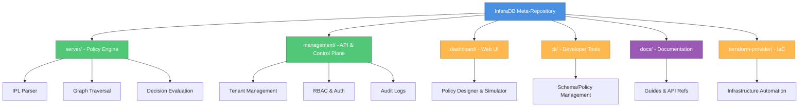

# InferaDB

**The distributed inference engine for authorization, designed for fine-grained, low-latency environments.**

InferaDB provides relationship-based access control (ReBAC) through a graph-based policy engine that evaluates authorization decisions in microseconds. Think Zanzibar-inspired access control with native policy language support, multi-tenancy, and API-first design.

---

## What's Inside

This is a **meta-repository** that orchestrates all InferaDB components via git submodules:

| Component                                  | Description                                                            |
| ------------------------------------------ | ---------------------------------------------------------------------- |
| [server/](server/)                         | Core policy engine - IPL parsing, graph traversal, decision evaluation |
| [management/](management/)                 | Management API - Tenant orchestration, RBAC, audit logs                |
| [dashboard/](dashboard/)                   | Web console for policy design, simulation, observability               |
| [cli/](cli/)                               | Developer tooling for schemas, policies, modules                       |
| [docs/](docs/)                             | Comprehensive guides and API references                                |
| [terraform-provider/](terraform-provider/) | Infrastructure as code for InferaDB deployment                         |

---

## Quick Start

### Prerequisites

- **Make** - Build orchestration
- **[Mise](https://mise.jdx.dev/)** (optional) - Tool version management
- **Rust** 1.91+ - If not using Mise

### 1. Clone with Submodules

```bash
git clone https://github.com/inferadb/inferadb
cd inferadb
git submodule init && git submodule update --remote
```

### 2. Setup Development Environment

```bash
make setup  # Installs tools, downloads dependencies
```

This runs setup for both `server/` and `management/` components.

### 3. Run Tests

```bash
# Test both projects
make test

# Or test individually
make server-test
make management-test
```

### 4. Start Development Server

```bash
# Start server in watch mode
make server-dev

# Or start management API
make management-dev
```

---

## Available Commands

The root Makefile delegates to component-specific Makefiles. All commands support both **combined** (run on all projects) and **component-specific** execution.

### Combined Commands (Server + Management)

```bash
make test      # Run tests in both projects
make build     # Build both projects (debug)
make check     # Run all quality checks (format, lint, audit)
make clean     # Clean build artifacts
```

### Server-Specific Commands

```bash
make server-test          # Run server tests
make server-dev           # Start with auto-reload
make server-build         # Build debug binary
make server-release       # Build optimized release
make server-benchmark     # Run benchmarks
```

### Management-Specific Commands

```bash
make management-test      # Run management tests
make management-dev       # Start with auto-reload
make management-build     # Build debug binary
make management-release   # Build optimized release
```

### Meta-Repository Commands

```bash
make help          # Show all available commands
make setup         # One-time development setup
make reset         # Full reset (clean all artifacts)
```

For detailed command information:

```bash
make help              # Root commands
make -C server help    # Server commands
make -C management help # Management commands
```

---

## Architecture Overview



**Color Legend**: 🟦 Meta-Repo · 🟩 Production-Ready · 🟧 In Development · 🟪 Documentation

### Core Technologies

- **Server**: Rust, FoundationDB, gRPC
- **Management**: Rust, Axum, PostgreSQL/FoundationDB
- **Dashboard**: TanStack Start, Hono, React (planned)
- **CLI**: Rust, Clap (planned)

---

## Development Workflow

### Working on a Specific Component

Each submodule has its own detailed README:

- [Server Development Guide](server/README.md) - Policy engine internals
- [Management API Guide](management/README.md) - API architecture
- [Integration Examples](examples/) - End-to-end usage examples

### Running Integration Tests

```bash
# FoundationDB integration tests (requires Docker)
make server-test-fdb
make management-test-fdb
```

### Code Quality

```bash
make check         # Run all checks (format, lint, audit)
make format        # Format code (rustfmt, prettier, taplo)
make lint          # Run clippy
make audit         # Security audit
```

### Documentation

```bash
make doc           # Generate and open Rust docs
```

---

## Project Status

### ✅ Production-Ready Components

**Server** - Core policy engine with full IPL support, graph-based relationship traversal, and microsecond-latency decision evaluation. Battle-tested with comprehensive test coverage.

**Management** - Production-grade API for tenant orchestration, user management, RBAC, and audit logging. Includes secure authentication (Ed25519, Argon2id), multi-tenancy isolation, and complete audit trail.

### 🚧 In Development

**Dashboard** - Web-based policy designer and simulator with real-time testing capabilities.

**CLI** - Command-line tools for local development, schema validation, and policy testing.

**Terraform Provider** - Infrastructure as code for automated InferaDB deployment.

---

## Resources

- **Documentation**: [docs/](docs/) - Comprehensive guides and references
- **Examples**: [examples/](examples/) - Integration examples and tutorials
- **Contributing**: See individual component READMEs for contribution guidelines
- **Security**: Report vulnerabilities via GitHub Security Advisories

---

## License

This meta-repository orchestrates multiple independent projects, each with its own licensing:

- **Server**: See [server/LICENSE](server/LICENSE)
- **Management**: See [management/LICENSE](management/LICENSE)
- **Dashboard**: See [dashboard/LICENSE](dashboard/LICENSE) (when available)
- **CLI**: See [cli/LICENSE](cli/LICENSE) (when available)

Please review each component's license individually.

---

## Need Help?

1. **Getting Started Issues**: Check component-specific READMEs ([server/](server/), [management/](management/))
2. **Integration Examples**: See [examples/](examples/) directory
3. **API Documentation**: Run `make doc` to view generated documentation
4. **Questions**: Open a discussion on GitHub

For component-specific questions, refer to the respective submodule repositories.
