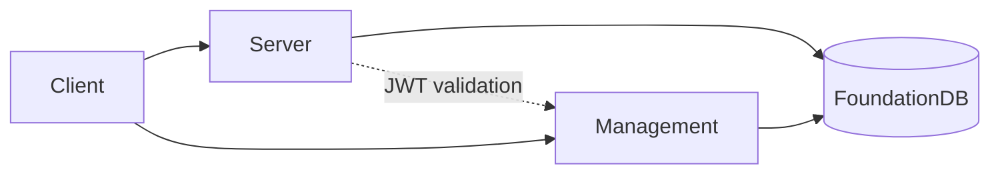

# InferaDB

**The distributed inference engine for authorization** — fine-grained, low-latency permission checks at scale.

Inspired by [Google Zanzibar](https://research.google/pubs/zanzibar-googles-consistent-global-authorization-system/). Built on [AuthZEN](https://openid.net/wg/authzen/).

## Quick Start

```bash
git clone https://github.com/inferadb/inferadb && cd inferadb
git submodule update --init --remote
make setup && make server-dev
```

Verify with a permission check:

```bash
curl -X POST http://localhost:8080/v1/evaluate \
  -H "Content-Type: application/json" \
  -d '{"evaluations": [{"subject": "user:alice", "resource": "doc:readme", "permission": "viewer"}]}'
```

## Features

- **ReBAC** — Model hierarchies, groups, and ownership as traversable graphs
- **Declarative Policies (IPL)** — Composable, version-controlled, testable before deployment
- **Sub-millisecond Latency** — FoundationDB-backed storage with co-located computation
- **Multi-Tenant** — Isolated namespaces, per-tenant encryption, auditable logs
- **WASM Extensible** — Embed custom logic in sandboxed modules

## Components

| Component                  | Purpose                          | Status  |
| -------------------------- | -------------------------------- | ------- |
| [server/](server/)         | Authorization engine (IPL, APIs) | Active  |
| [management/](management/) | Control plane (tenants, auth)    | Active  |
| [tests/](tests/)           | E2E integration tests            | Active  |
| [docs/](docs/)             | Specifications, guides           | Active  |
| dashboard/                 | Web console                      | Planned |
| cli/                       | Developer CLI                    | Planned |

## Commands

```bash
make help             # List all commands
make build            # Debug build
make check            # Format, lint, audit
make test             # Unit tests
make test-e2e         # E2E tests (requires K8s)
make server-dev       # Server with hot-reload
make management-dev   # Management API with hot-reload
```

### Kubernetes

```bash
make k8s-start    # Start local K8s stack
make k8s-status   # Check deployment health
make k8s-stop     # Stop (preserves data)
make k8s-purge    # Remove all resources
```

## Architecture



**Stack:** Rust, FoundationDB, gRPC/REST, Kubernetes

## Documentation

- [server/README.md](server/README.md) — Authorization engine
- [management/README.md](management/README.md) — Control plane API
- [tests/README.md](tests/README.md) — Integration testing
- [docs/](docs/) — Full specifications

## License

Component-specific. See [server/LICENSE](server/LICENSE), [management/LICENSE](management/LICENSE).
