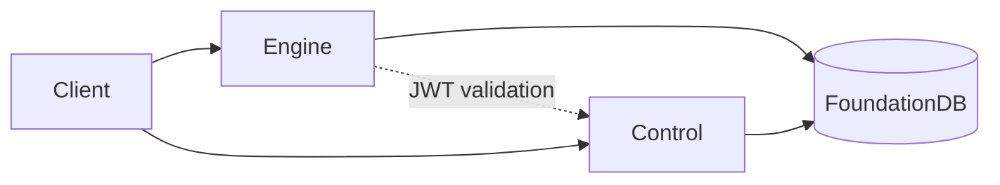

# InferaDB

Distributed fine-grained authorization engine with sub-millisecond latency at scale.

Inspired by [Google Zanzibar](https://research.google/pubs/zanzibar-googles-consistent-global-authorization-system/). [AuthZEN](https://openid.net/wg/authzen/) compliant.

## Quick Start

```bash
git clone https://github.com/inferadb/inferadb && cd inferadb
git submodule update --init --recursive
make setup && make engine-dev
```

Check a permission:

```bash
curl -N -X POST http://localhost:8080/v1/evaluate \
  -H "Content-Type: application/json" \
  -d '{"evaluations": [{"subject": "user:alice", "resource": "doc:readme", "permission": "viewer"}]}'
```

Response (SSE stream):

```text
data: {"decision":"allow","index":0}

event: summary
data: {"total":1,"complete":true}
```

## Features

- **Sub-millisecond latency** — <1ms cached, 3-5ms uncached at 100K+ RPS
- **Declarative policies (IPL)** — Version-controlled, testable, composable
- **WASM extensibility** — Custom logic in sandboxed modules
- **Multi-tenant isolation** — Per-tenant encryption, namespaces, audit logs
- **Graph-native ReBAC** — Hierarchies, groups, ownership as traversable relationships

## Components

| Component                                                                                | Purpose                                                            |
| ---------------------------------------------------------------------------------------- | ------------------------------------------------------------------ |
| [engine/](https://github.com/inferadb/engine/)                                           | Authorization Engine (Policy Decision Endpoint)                    |
| [control/](https://github.com/inferadb/control/)                                         | Control Plane (Policy Administration Endpoint)                     |
| [dashboard/](https://github.com/inferadb/dashboard/)                                     | Self-Service Management Interface                                  |
| [cli/](https://github.com/inferadb/cli/)                                                 | Administrative Command Line Tooling                                |
| [tests/](https://github.com/inferadb/tests/)                                             | End-to-end Integration Tests                                       |
| [docs/](https://github.com/inferadb/docs/)                                               | Technical specifications, design documents, and deployment guides. |
| [terraform-provider-inferadb/](https://github.com/inferadb/terraform-provider-inferadb/) | Terraform Provider                                                 |

## Architecture



**Stack:** Rust, FoundationDB, gRPC/REST, Kubernetes

## Commands

```bash
make help             # List all commands
make build            # Debug build
make check            # Format, lint, audit
make test             # Unit tests
make engine-dev       # Engine with hot-reload
make control-dev      # Control plane with hot-reload
make dashboard-dev    # Dashboard on localhost:5173
```

Kubernetes:

```bash
make k8s-start        # Start local K8s stack
make k8s-status       # Check deployment health
make k8s-stop         # Stop (preserves data)
make k8s-purge        # Remove all resources
```

## Documentation

- [engine/README.md](https://github.com/inferadb/engine/README.md) — Authorization engine
- [control/README.md](https://github.com/inferadb/control/README.md) — Control plane
- [tests/README.md](https://github.com/inferadb/tests/README.md) — Integration tests
- [docs/](https://github.com/inferadb/docs/) — Full specifications

## License

Component-specific. See [LICENSE.md](LICENSE.md).
