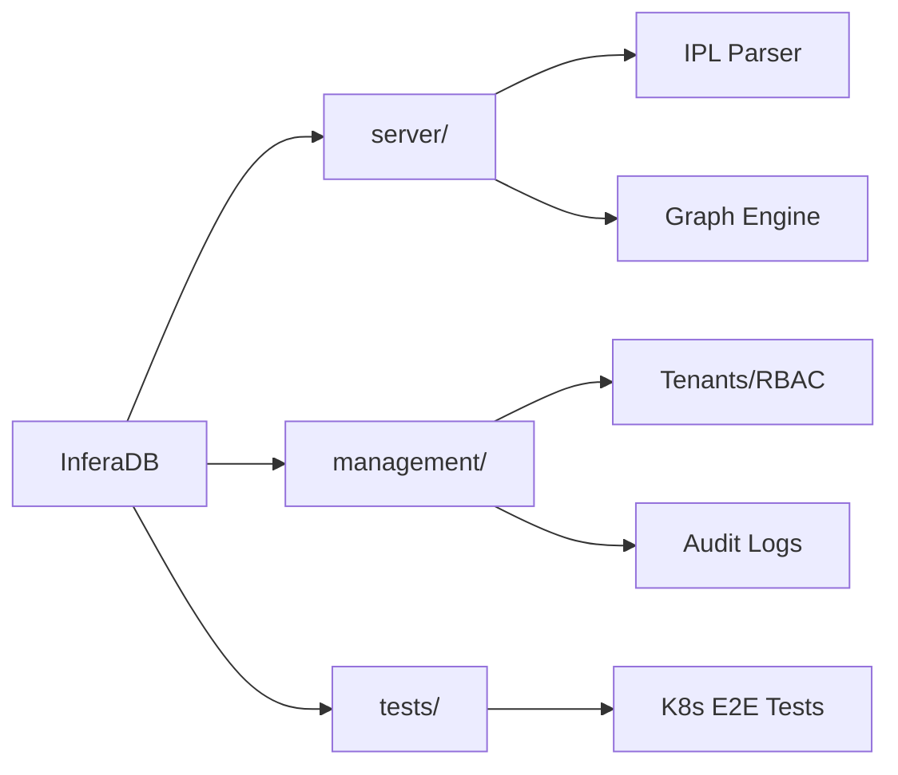

# InferaDB

**Inference-driven authorization database for fine-grained access control.**

InferaDB models authorization as a graph of relationships and logical inferences—not static roles or attributes. Inspired by [Google Zanzibar](https://research.google/pubs/zanzibar-googles-consistent-global-authorization-system/), it delivers sub-millisecond decisions with strong consistency across distributed, multi-tenant deployments.

## Why InferaDB

- **Relationship-Based Access Control (ReBAC)** — Model complex hierarchies, group memberships, and resource ownership as traversable graphs
- **Declarative Policy Language (IPL)** — Define permissions with composable, version-controlled policies that are testable before deployment
- **Microsecond Latency** — Co-located computation with FoundationDB-backed storage for consistent, low-latency decisions at scale
- **Multi-Tenant by Design** — Isolated policy namespaces, per-tenant encryption, and auditable decision logs
- **Extensible via WASM** — Embed custom logic (compliance rules, risk scoring, contextual checks) in sandboxed, deterministic modules

## Components

| Directory                                                    | Purpose                                     |
| ------------------------------------------------------------ | ------------------------------------------- |
| [server/](server/)                                           | Policy engine (IPL parser, graph traversal) |
| [management/](management/)                                   | Control plane (tenants, RBAC, audit)        |
| [tests/](tests/)                                             | E2E integration tests, K8s scripts          |
| [docs/](docs/)                                               | Specifications and deployment guides        |
| [dashboard/](dashboard/)                                     | Web console (planned)                       |
| [cli/](cli/)                                                 | Developer CLI (planned)                     |
| [terraform-provider-inferadb/](terraform-provider-inferadb/) | IaC provider (planned)                      |

## Quick Start

**Prerequisites:** Make, Rust 1.91+ (or [Mise](https://mise.jdx.dev/) for version management)

```bash
git clone https://github.com/inferadb/inferadb
cd inferadb
git submodule init && git submodule update --remote
make setup                          # Install tools, fetch dependencies
make test                           # Run all tests
make server-dev                     # Start server with auto-reload
```

## Commands

Run `make help` for full list. Pattern: `make <component>-<command>` (e.g., `make server-test`).

| Command      | Purpose                    |
| ------------ | -------------------------- |
| `make build` | Build (debug)              |
| `make check` | Format, lint, audit        |
| `make clean` | Clean build artifacts      |
| `make ci`    | Full CI pipeline locally   |

### Kubernetes Environment

| Command           | Purpose                           |
| ----------------- | --------------------------------- |
| `make k8s-start`  | Start local K8s environment       |
| `make k8s-stop`   | Stop environment (preserves data) |
| `make k8s-status` | Check deployment health           |
| `make k8s-purge`  | Remove all resources and data     |

### Test Execution

| Command         | Purpose                          | Requires    |
| --------------- | -------------------------------- | ----------- |
| `make test`     | Unit tests (server + management) | Nothing     |
| `make test-fdb` | FDB integration tests            | Docker      |
| `make test-e2e` | E2E tests in K8s                 | K8s running |

### Component-Specific

```bash
make server-dev       # Start server with auto-reload
make management-dev   # Start management API with auto-reload
```

## Architecture



**Tech Stack:** Server (Rust, FoundationDB, gRPC) · Management (Rust, Axum, FoundationDB) · Tests (Rust, Kubernetes)

## Resources

| Resource                                     | Description                 |
| -------------------------------------------- | --------------------------- |
| [server/README.md](server/README.md)         | Policy engine development   |
| [management/README.md](management/README.md) | Management API architecture |
| [tests/README.md](tests/README.md)           | Integration test guide      |
| [docs/](docs/)                               | Specifications, deployment  |

## License

Each component has its own license. See [server/LICENSE](server/LICENSE), [management/LICENSE](management/LICENSE), [tests/LICENSE](tests/LICENSE).
