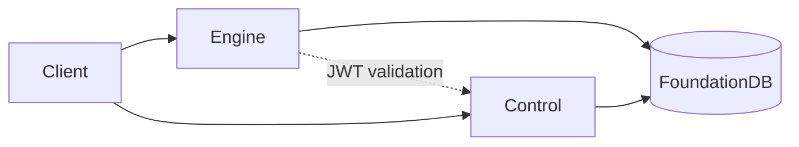

<div align="center">
    <p><a href="https://inferadb.com"></a></p>
    <h1>InferaDB</h1>
    <p>
        <a href="https://discord.gg/inferadb"></a>
        <a href="#license"></a>
    </p>
    <p>Distributed fine-grained authorization engine with sub-millisecond latency at scale</p>
</div>

> [!IMPORTANT]
> Under active development. Not production-ready.

Inspired by [Google Zanzibar](https://research.google/pubs/zanzibar-googles-consistent-global-authorization-system/). [AuthZEN](https://openid.net/wg/authzen/) compliant.

## Quick Start

```bash
git clone https://github.com/inferadb/inferadb && cd inferadb
mise run setup
```

> Requires [mise](https://mise.jdx.dev/). Alternatively: `git submodule update --init --recursive`

Check a permission:

```bash
curl -N -X POST http://localhost:8080/v1/evaluate \
  -H "Content-Type: application/json" \
  -d '{"evaluations": [{"subject": "user:alice", "resource": "doc:readme", "permission": "viewer"}]}'
```

Response (SSE stream):

```text
data: {"decision":"allow","index":0}

event: summary
data: {"total":1,"complete":true}
```

## Features

- **Sub-millisecond latency** — <1ms cached, 3-5ms uncached at 100K+ RPS
- **Declarative policies (IPL)** — Version-controlled, testable, composable
- **WASM extensibility** — Custom logic in sandboxed modules
- **Multi-tenant isolation** — Per-tenant encryption, namespaces, audit logs
- **Graph-native ReBAC** — Hierarchies, groups, ownership as traversable relationships

## Repository Structure

This meta-repository aggregates all InferaDB components as git submodules.

### Core Services

| Component                                        | Purpose           |
| ------------------------------------------------ | ----------------- |
| [engine/](https://github.com/inferadb/engine/)   | Authorization Engine |
| [control/](https://github.com/inferadb/control/) | Control Plane     |
| [dashboard/](https://github.com/inferadb/dashboard/) | Management UI |

### Developer Tools

| Component                                                                                | Purpose            |
| ---------------------------------------------------------------------------------------- | ------------------ |
| [cli/](https://github.com/inferadb/cli/)                                                 | CLI                |
| [sdks/rust](https://github.com/inferadb/rust/)                                           | Rust SDK           |
| [terraform-provider-inferadb/](https://github.com/inferadb/terraform-provider-inferadb/) | Terraform Provider |

### Infrastructure

| Component                                            | Purpose                        |
| ---------------------------------------------------- | ------------------------------ |
| [deploy/](https://github.com/inferadb/deploy/)       | Deployment (GitOps, Talos, Flux) |
| [terraform/](https://github.com/inferadb/terraform/) | Terraform modules              |

### Internal

| Component                                        | Purpose                 |
| ------------------------------------------------ | ----------------------- |
| [tests/](https://github.com/inferadb/tests/)     | Integration tests       |
| [docs/](https://github.com/inferadb/docs/)       | Specifications          |
| [teapot/](https://github.com/inferadb/teapot/)   | TUI framework           |
| [github/](https://github.com/inferadb/.github/)  | Organization config     |

## Architecture



**Stack:** Rust, FoundationDB, gRPC/REST, Kubernetes

## Documentation

- [docs/](https://github.com/inferadb/docs/) — Specifications and design docs
- [deploy/](https://github.com/inferadb/deploy/) — Deployment guides and runbooks

Each submodule contains its own README with component-specific documentation.

## Community

Join us on [Discord](https://discord.gg/inferadb) for questions, discussions, and contributions.

## License

Licensed under either of:

- [Apache License, Version 2.0](LICENSE-APACHE)
- [MIT License](LICENSE-MIT)

at your option.
